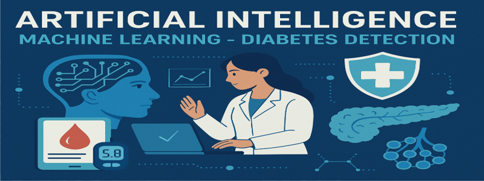

# Diabetes Prediction Model

This project implements a machine learning model to predict diabetes based on various health indicators and patient characteristics. The model uses both supervised and unsupervised learning approaches to provide accurate predictions.

## Banner


## Preview


## Purpose & Objective

- Identify whether a person has diabetes or not, using an artificial intelligence model based on medical data.

## Authors 
- Tomás Castro  
- Bryan Silva  
- Camilo  

## Link to the colab

- https://colab.research.google.com/drive/1TPbi67vxh3m--fbglk-WES_vgEaOfZhj#scrollTo=xCzHLENAlhHQ

## Video about the project

- https://www.youtube.com/watch?v=akJEb4e9mek

## Test the model!

https://mltodiabetes.streamlit.app/

## Features

- Data preprocessing and visualization
- Multiple machine learning models:
  - Gaussian Naive Bayes
  - Decision Tree
  - Random Forest
  - Logistic Regression
  - Support Vector Machine (SVM)
- PCA (Principal Component Analysis) implementation
- Interactive user input for predictions
- Comprehensive model evaluation metrics

## Datasets

- **Main**: [Diabetes Prediction Dataset](https://www.kaggle.com/datasets/iammustafatz/diabetes-prediction-dataset)  
- **Auxiliar**: [Diabetes Health Indicators Dataset](https://www.kaggle.com/datasets/alexteboul/diabetes-health-indicators-dataset?resource=download&select=diabetes_binary_5050split_health_indicators_BRFSS2015.csv)

The project uses two datasets:
1. Main dataset with patient information
2. Auxiliary dataset with additional health indicators

The datasets include features such as:
- Age
- Gender
- BMI
- HbA1c level
- Blood glucose level
- Hypertension
- Heart disease
- High cholesterol
- Stroke history
- Heart attack history

## Installation

1. Clone the repository:
```bash
git clone <repository-url>
cd diabetes-prediction-model
```

2. Create a virtual environment (recommended):
```bash
python -m venv venv
source venv/bin/activate  # On Windows: venv\Scripts\activate
```

3. Install dependencies:
```bash
pip install -r requirements-dev.txt
```

## Usage

1. Run the main script:
```bash
python Diabetes_Prediction_Model_IA_2025.py
```

2. The script will:
   - Load and preprocess the data
   - Train multiple models
   - Provide model evaluation metrics
   - Allow for interactive predictions

3. For predictions, you can input:
   - Age
   - Gender
   - Height
   - Weight
   - HbA1c level
   - Blood glucose level
   - Health conditions (hypertension, heart disease, etc.)

## Model Performance

The project implements several models with their respective performance metrics:
- Random Forest (with and without PCA)
- Gaussian Naive Bayes
- Decision Tree
- Logistic Regression
- SVM

Each model's performance is evaluated using:
- Accuracy
- Precision
- Recall
- F1-score

## Requirements

- Python 3.8 or higher
- Dependencies listed in `requirements-dev.txt`

## Project Structure

```
diabetes-prediction-model/
├── Diabetes_Prediction_Model_IA_2025.py
├── requirements.txt
├── README.md
└── venv/
```

## Contributing

1. Fork the repository
2. Create a feature branch
3. Commit your changes
4. Push to the branch
5. Create a Pull Request

## License

This project is licensed under the MIT License - see the LICENSE file for details.

